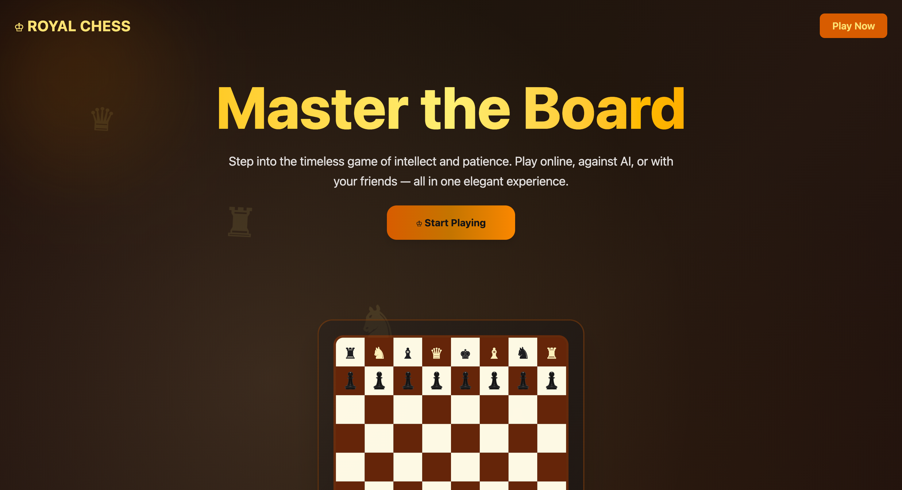
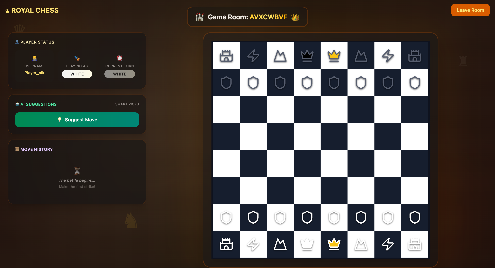

# ♞ Chess — Real-Time Multiplayer Game

A **production-grade, real-time multiplayer chess platform** built with **Next.js**, **TypeScript**, **WebSocket**, and **Docker**, featuring full rule implementation, elegant UI, and modular architecture.


---

## 🚀 Live Demo
🎮 **Play Now:** [https://chesss.thecabbro.com](https://chesss.thecabbro.com)

---

## 🧩 Key Features
- ✅ **Real-time multiplayer gameplay** via WebSocket  
- ✅ **AI-powered move suggestions** with scoring  
- ✅ **Full chess rule set** — castling, en passant, promotion  
- ✅ **Room-based system** for private or public matches  
- ✅ **Responsive UI** with Tailwind CSS and chess-themed visuals  
- ✅ **Move history tracking** and real-time synchronization  
- ✅ **Dockerized deployment** for instant setup  
- ✅ **Monorepo structure** managed with Turborepo + pnpm  
- ✅ **Type-safe game logic** using TypeScript across all modules  

---

## 🖼️ Screenshots

### Landing Page
  
*Create or join chess rooms instantly.*

### Gameplay Interface
  
*Real-time play, AI move suggestions, and move tracking.*

---

## 🏗️ Architecture Overview

- **Frontend:** Next.js 15 + React 19 + Tailwind CSS v4  
- **Backend:** Node.js + ws (WebSocket)  
- **Game Logic:** Custom TypeScript chess engine  
- **Infra:** Docker + Render + Vercel  
- **Build System:** Turborepo + pnpm  
- **CI/CD:** GitHub Actions (automated build/test/deploy)

---

## 🐳 Quick Start (Docker)

```bash
git clone https://github.com/nikhilachale/Chess.git
cd Chess

# Build and start containers
docker-compose up --build

# Access
Frontend: http://localhost:3000
WebSocket: ws://localhost:8080
# ♞ Chess — Real-Time Multiplayer Game

A **production-grade, real-time multiplayer chess platform** built with **Next.js**, **TypeScript**, **WebSocket**, and **Docker**, featuring full rule implementation, elegant UI, and modular architecture.


---

## 🚀 Live Demo
🎮 **Play Now:** [https://chesss.thecabbro.com](https://chesss.thecabbro.com)

---

## 🧩 Key Features
- ✅ **Real-time multiplayer gameplay** via WebSocket  
- ✅ **AI-powered move suggestions** with scoring  
- ✅ **Full chess rule set** — castling, en passant, promotion  
- ✅ **Room-based system** for private or public matches  
- ✅ **Responsive UI** with Tailwind CSS and chess-themed visuals  
- ✅ **Move history tracking** and real-time synchronization  
- ✅ **Dockerized deployment** for instant setup  
- ✅ **Monorepo structure** managed with Turborepo + pnpm  
- ✅ **Type-safe game logic** using TypeScript across all modules  

---

## 🖼️ Screenshots

### Landing Page
  
*Create or join chess rooms instantly.*

### Gameplay Interface
  
*Real-time play, AI move suggestions, and move tracking.*

---

## 🏗️ Architecture Overview

```
┌─────────────────┐    WebSocket    ┌─────────────────┐
│   Next.js UI    │◄──────────────►│   WebSocket     │
│   (Port 3000)   │                 │   Server        │
│                 │                 │   (Port 8080)   │
│  - Game Board   │                 │  - Room Mgmt    │
│  - Move Input   │                 │  - Move Sync    │
│  - Player UI    │                 │  - Validation   │
└─────────────────┘                 └─────────────────┘
```

- **Frontend:** Next.js 15 + React 19 + Tailwind CSS v4  
- **Backend:** Node.js + ws (WebSocket)  
- **Game Logic:** Custom TypeScript chess engine  
- **Infra:** Docker + Render + Vercel  
- **Build System:** Turborepo + pnpm  
- **CI/CD:** GitHub Actions (automated build/test/deploy)

---

## 🐳 Quick Start (Docker)

```bash
git clone https://github.com/nikhilachale/Chess.git
cd Chess

# Build and start containers
docker-compose up --build

# Access
Frontend: http://localhost:3000
WebSocket: ws://localhost:8080
```

### Manual Docker Build
```bash
docker build -f docker/Dockerfile.ui -t chess-ui .
docker build -f docker/Dockerfile.ws -t chess-ws .
docker run -p 8080:8080 chess-ws
docker run -p 3000:3000 -e NEXT_PUBLIC_WS_URL=ws://localhost:8080 chess-ui
```

---

## 🧠 Local Development

### Prerequisites
- Node.js 18+
- pnpm (recommended)
- Docker (optional, for production parity)

### Commands
```bash
pnpm install
pnpm dev --filter=socket   # Start WebSocket
pnpm dev --filter=ui       # Start frontend
pnpm lint                  # Linting
pnpm type-check            # Type safety check
pnpm build                 # Production build
```

---

## ⚙️ Environment Variables

Create a `.env` file:
```bash
NEXT_PUBLIC_WS_URL=ws://localhost:8080
```

---

## 🧱 Monorepo Layout

```
chess/
├── apps/
│   ├── ui/                  # Next.js frontend
│   ├── socket/              # WebSocket server
│   └── backend/             # Express backend (optional)
├── packages/
│   ├── chess/               # Core chess engine
│   ├── ui/                  # Shared components
│   ├── eslint-config/       # Shared linting rules
│   └── typescript-config/   # TS configs
├── docker/
│   ├── Dockerfile.ui
│   └── Dockerfile.ws
├── docker-compose.yml
└── .env
```

---

## 🧪 CI/CD Pipeline
- **GitHub Actions:** Lint, build, test, deploy  
- **Docker:** Containerized services for consistency  
- **Vercel + Render:** Automated deployments  
- **Badges:** Build & deploy status displayed in README  

---

## 🧩 Planned Enhancements (Roadmap)
- [ ] Spectator mode  
- [ ] Player reconnect support  
- [ ] Player statistics and rating system  
- [ ] Match replays  
- [ ] In-game chat / emoji reactions  
- [ ] Dark mode toggle  

---

## ⚠️ Troubleshooting

**Port conflicts**
```bash
lsof -i :3000
lsof -i :8080
kill -9 <PID>
```

**Docker cleanup**
```bash
docker-compose down --volumes --rmi all
docker-compose build --no-cache
```

**Logs**
```bash
docker-compose logs -f
```

---

## 🤝 Contributing
1. Fork this repo  
2. Create a feature branch  
3. Run `pnpm dev` to test locally  
4. Submit a pull request  

### Screenshot Contributions
- Visit the live app and capture HD screenshots  
- Follow `/screenshots/README.md` for guidelines  
- Add them via PR

---

## 🧰 Tech Stack Summary

| Layer | Technology |
|-------|-------------|
| Frontend | Next.js 15, React 19, Tailwind CSS v4 |
| Backend | Node.js, ws (WebSocket) |
| Build System | Turborepo, pnpm |
| Containerization | Docker, Docker Compose |
| Deployment | Vercel (UI), Render (Socket) |
| Language | TypeScript (100%) |

---

## 🧑‍💻 Author
**Nikhil Achale**  
Final-Year B.Tech — NIT Patna  
Full-Stack & Web Developer  

🔗 [GitHub](https://github.com/nikhilachale)  
🔗 [LinkedIn](https://linkedin.com/in/nikhilachale)  
🌐 [Live Project](https://chesss.thecabbro.com)

---

## 📜 License
Licensed under the **MIT License**. Free for modification and commercial use.